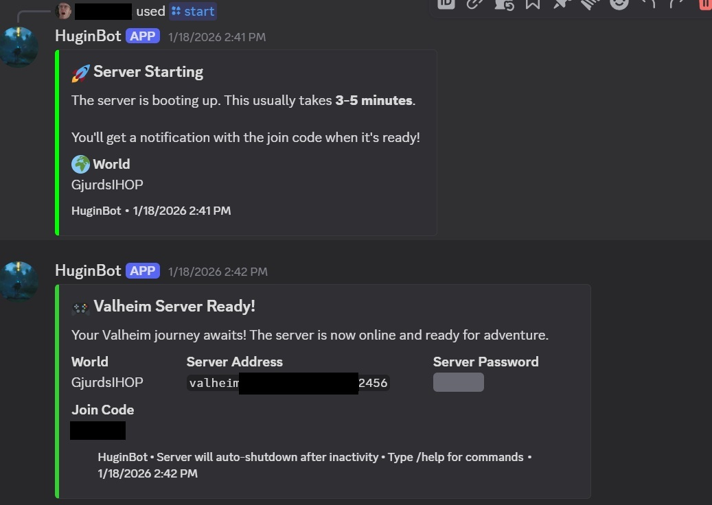
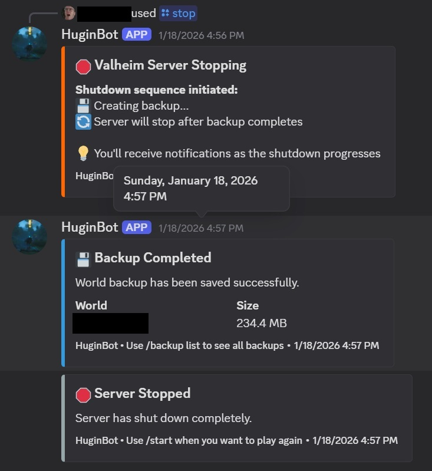
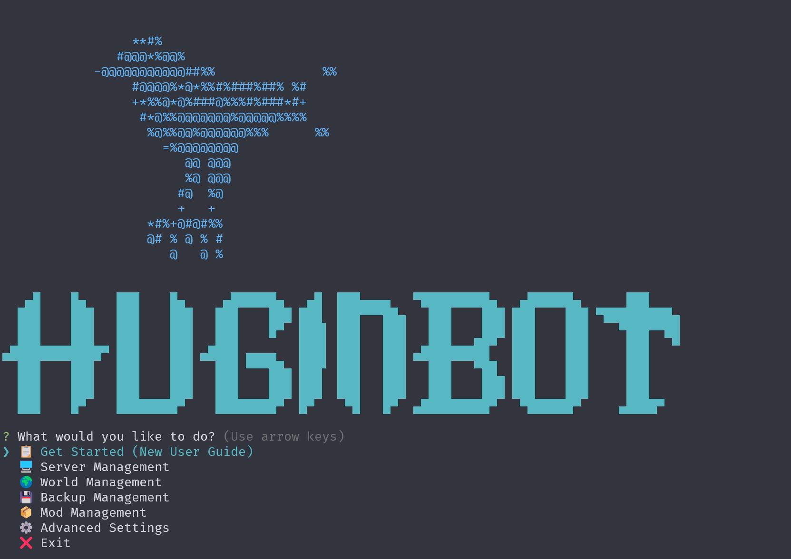

```
   ▄█    █▄    ███    █▄     ▄██████▄   ▄█  ███▄▄▄▄   ▀█████████▄   ▄██████▄      ███
  ███    ███   ███    ███   ███    ███ ███  ███▀▀▀██▄   ███    ███ ███    ███ ▀█████████▄
  ███    ███   ███    ███   ███    █▀  ███▌ ███   ███   ███    ███ ███    ███    ▀███▀▀██
 ▄███▄▄▄▄███▄▄ ███    ███  ▄███        ███▌ ███   ███  ▄███▄▄▄██▀  ███    ███     ███   ▀
▀▀███▀▀▀▀███▀  ███    ███ ▀▀███ ████▄  ███▌ ███   ███ ▀▀███▀▀▀██▄  ███    ███     ███
  ███    ███   ███    ███   ███    ███ ███  ███   ███   ███    ██▄ ███    ███     ███
  ███    ███   ███    ███   ███    ███ ███  ███   ███   ███    ███ ███    ███     ███
  ███    █▀    ████████▀    ████████▀  █▀    ▀█   █▀  ▄█████████▀   ▀██████▀     ▄████▀
```

# HuginBot

A cost-effective AWS-based Valheim server manager with Discord integration. Start, stop, and manage your Valheim server directly from Discord while only paying for the time you play.

## 🎮 Key Features

- **Discord Bot Integration** - Control your server with slash commands
- **Custom Domain Support** - Connect via your own domain (e.g., `valheim.yourdomain.com`) instead of join codes
- **Auto-Shutdown** - Configurable idle timeout (default 20 min) to save costs
- **Multiple Worlds** - Run different worlds for different Discord servers
- **Per-World Configuration** - Custom server settings, mods, and modifiers per world
- **Mod Management** - BepInEx support with Thunderstore integration
- **Automated Backups** - Scheduled backups to S3 with configurable retention
- **Interactive CLI** - Easy setup wizard and management interface
- **Secure Configuration** - Discord webhooks and settings stored in AWS SSM Parameter Store
- **Cost-Effective** - Pay only when playing (~$0.05/hour for t3.medium)

## 🚀 Quick Start

### Prerequisites

- AWS Account with administrative access ([Setup Guide](docs/aws-setup.md))
- Node.js 16+ and npm
- Discord server where you have admin permissions ([Setup Guide](docs/discord-setup.md))
- Basic familiarity with command line

**⏱️ Estimated setup time:** 20-30 minutes

### 1. Clone and Install

```bash
git clone https://github.com/Dardin-dale/huginbot.git
cd huginbot
npm install
```

### 2. Configure AWS Credentials

Follow the [AWS Setup Guide](docs/aws-setup.md) to:
- Install AWS CLI
- Create IAM user with appropriate permissions
- Configure credentials with `aws configure`

**Quick version:**
```bash
# Install AWS CLI (if not already installed)
# macOS: brew install awscli
# Linux/Windows: see docs/aws-setup.md

# Configure credentials
aws configure
# Enter your AWS Access Key ID, Secret Key, and preferred region
```

### 3. Set Up Discord Bot

Follow the [Discord Setup Guide](docs/discord-setup.md) to:
- Create Discord application
- Get Application ID, Public Key, and Bot Token
- Add bot to your Discord server

**Quick version:**
1. Go to https://discord.com/developers/applications
2. Create new application
3. Copy Application ID and Public Key
4. Create bot and copy Bot Token
5. Save these for next step

### 4. Configure HuginBot

Choose your configuration style:

**Option A: Interactive Setup Wizard (Recommended)**
```bash
npm run cli
```
Select **"📋 Get Started (New User Guide)"** and follow the prompts.

**Option B: Manual Configuration**
```bash
# Copy example configuration
cp examples/.env.minimal .env

# Edit .env and fill in:
# - Discord credentials from step 3
# - Your Discord server ID
# - World password
# See: docs/discord-setup.md for finding your Discord server ID
```

**📚 Example configs available:**
- [Minimal config](examples/.env.minimal) - Quick start, single world
- [Full-featured config](examples/.env.full-featured) - Multiple worlds, custom domain, advanced features

### 5. Deploy to AWS

```bash
npm run deploy
```

This creates all necessary AWS resources (takes ~10-15 minutes).

**After deployment**, copy the API Gateway URL from the output.

### 6. Configure Discord Interactions Endpoint

**Critical step:** Connect Discord to your deployed infrastructure

1. Go to [Discord Developer Portal](https://discord.com/developers/applications)
2. Select your application → "General Information"
3. Find "Interactions Endpoint URL"
4. Enter: `https://YOUR-API-GATEWAY-URL/prod/valheim/control`
   - Replace `YOUR-API-GATEWAY-URL` with the URL from deployment output
   - Must include `/valheim/control` at the end
5. Click "Save Changes"

Discord will verify the endpoint. If successful, you'll see a green checkmark.

**Troubleshooting:** If verification fails, see [Troubleshooting Guide](docs/troubleshooting.md#application-did-not-respond)

### 7. Initialize in Discord

In your Discord server, run:
```
/setup
```

This creates a webhook for server notifications in the current channel. The webhook URL is securely stored in AWS SSM Parameter Store.

### 8. Start Playing!

```
/start
```

The server takes 5-10 minutes to fully start. Once ready, the join code will be posted to Discord.

**🎮 You're ready to play Valheim!**

## 📝 Configuration

### Environment Variables

Your `.env` file will be created by the setup wizard. Here's what it contains:

```bash
# AWS Configuration
AWS_REGION=us-west-2
AWS_PROFILE=default

# Discord Bot Configuration
DISCORD_APP_ID=your_app_id
DISCORD_BOT_PUBLIC_KEY=your_public_key
DISCORD_BOT_SECRET_TOKEN=your_bot_token

# World Configuration (managed by CLI)
WORLD_COUNT=1
WORLD_1_NAME=MainWorld
WORLD_1_WORLD_NAME=Midgard
WORLD_1_PASSWORD=your_password
WORLD_1_DISCORD_ID=your_discord_server_id

# Server Configuration
VALHEIM_SERVER_NAME=My Valheim Server
VALHEIM_ADMIN_IDS=steam_id_1 steam_id_2
VALHEIM_INSTANCE_TYPE=t3.medium
BACKUPS_TO_KEEP=7
```

### Adding More Worlds

Use the CLI to add worlds:

```bash
npm run cli
```

Select **"🌍 World Management"** → **"Add World"**

Each world can be linked to a different Discord server.

### Per-World Configuration

Each world can have custom settings that override the defaults. Configure in `.env`:

```bash
# World-specific overrides
WORLD_1_BEPINEX=true                    # Enable BepInEx mod loading
WORLD_1_MODS=["ValheimPlus", "EpicLoot"] # Mods from your library
WORLD_1_SERVER_ARGS=-crossplay -preset casual  # Custom server arguments
WORLD_1_SERVER_PUBLIC=false              # Hide from server browser
WORLD_1_UPDATE_INTERVAL=3600             # Check for updates hourly
```

**Available Valheim modifiers** (no mods required):
```bash
WORLD_1_SERVER_ARGS="-crossplay -modifier combat hard -modifier raids none"
```

| Modifier | Values |
|----------|--------|
| `combat` | veryeasy, easy, hard, veryhard |
| `deathpenalty` | casual, veryeasy, easy, hard, hardcore |
| `resources` | muchless, less, more, muchmore |
| `raids` | none, muchless, less, more, muchmore |
| `portals` | casual, hard, veryhard |

Or use presets: `-preset casual`, `-preset hard`, `-preset hardcore`, `-preset immersive`

### Mod Management

HuginBot supports BepInEx mods with a centralized library stored in S3.

**Add mods to your library:**
```bash
npm run cli -- mods add           # Add local mod file
npm run cli -- mods import EpicLoot  # Import from Thunderstore
npm run cli -- mods search "networking"  # Search Thunderstore
```

**Assign mods to worlds** via `.env`:
```bash
WORLD_1_BEPINEX=true
WORLD_1_MODS=["EpicLoot", "BetterNetworking_Valheim"]
```

**View mods in Discord:**
```
/mods list
```

For detailed mod management, see **[Mod Management Guide](docs/mods.md)**

### Auto-Shutdown Configuration

The server automatically stops after a period of inactivity to save costs:

```bash
# In .env - minutes of idle time before auto-shutdown
AUTO_SHUTDOWN_MINUTES=20        # Default: 20 minutes
AUTO_SHUTDOWN_MINUTES=off       # Disable auto-shutdown
```

Check current setting in Discord with `/status check`.

### Backup Configuration

HuginBot uses a dual backup system for maximum reliability:

#### Docker Container Backups (Primary)
```bash
# Global backup settings (apply to all worlds)
DOCKER_BACKUP_CRON="0 */2 * * *"     # Every 2 hours
DOCKER_BACKUP_MAX_COUNT=12           # Keep 12 backups (24 hours)
DOCKER_BACKUP_MAX_AGE=1440           # Max age 1440 minutes (24 hours)
DOCKER_BACKUP_IF_IDLE=false          # Only backup when players active
DOCKER_BACKUP_IDLE_GRACE=60          # Wait 60 min after last disconnect
DOCKER_BACKUP_COMPRESS=true          # Compress backups (.tar.gz)
```

#### Per-World Backup Overrides
You can customize backup settings for specific worlds:
```bash
# Example: More frequent backups for important world
WORLD_1_BACKUP_CRON="0 */1 * * *"    # Every hour for World 1
WORLD_1_BACKUP_MAX_COUNT=24          # Keep 24 backups
WORLD_2_BACKUP_IF_IDLE=true          # Backup World 2 even when idle
```

#### S3 Long-term Storage
```bash
BACKUP_FREQUENCY_HOURS=24            # Daily S3 backups
BACKUPS_TO_KEEP=7                    # Keep 7 days of S3 backups
```

#### Backup Triggers
- **Automatic**: Container backups every 2 hours (configurable)
- **Pre-shutdown**: Automatic backup before server stop
- **Manual**: `/backup create` command in Discord
- **CLI**: Manual backups via CLI interface

#### Backup Locations
- **Container backups**: Stored in `/config/backups` inside container + S3
- **S3 backups**: `s3://your-bucket/worlds/world-name/backup-timestamp.tar.gz`
- **Retention**: Automatic cleanup based on count and age limits

## 🤖 Discord Commands

| Command | Description |
|---------|-------------|
| `/setup` | Initialize HuginBot in current channel |
| `/start [world]` | Start server with optional world |
| `/stop` | Stop the server |
| `/status check` | Check server status |
| `/status dashboard` | Create live status panel |
| `/controls` | Show interactive control panel |
| `/worlds list` | List available worlds |
| `/worlds switch` | Switch to different world |
| `/mods list` | Show mods enabled for current world |
| `/backup list` | Show recent backups from S3 |
| `/backup create` | Create manual backup (requires server running) |
| `/help` | Show command help |

### Example: Starting the Server



### Example: Stopping the Server



## 🖥️ CLI Management

Launch the interactive CLI:

```bash
npm run cli
```



### Main Menu Options

- **📋 Get Started** - First-time setup wizard
- **🖥️ Server Management** - Start/stop server, check status
- **🌍 World Management** - Add, edit, switch worlds
- **🔧 Mod Management** - Add, import, and sync mods
- **💾 Backup Management** - Create and manage backups
- **⚙️ Advanced Settings** - Parameter cleanup and configuration

### CLI Commands

```bash
npm run cli                        # Interactive menu
npm run cli -- mods list          # List mods in library
npm run cli -- mods import <mod>   # Import from Thunderstore
npm run cli -- mods search <term>  # Search Thunderstore
npm run cli -- worlds list         # List configured worlds
```

## 💰 Cost Breakdown

- **EC2 Instance**: ~$0.05/hour when running (t3.medium)
- **Lambda/API Gateway**: Usually free tier
- **S3 Storage**: ~$0.02/GB/month for backups
- **SSM Parameter Store**: Free (for webhooks and configuration)
- **Total**: ~$5-20/month depending on play time

The auto-shutdown feature ensures you only pay while playing!

## 📚 Documentation

### Setup Guides

- **[AWS Setup Guide](docs/aws-setup.md)** - Complete AWS configuration walkthrough
  - IAM user creation
  - AWS CLI setup
  - Region selection
  - Cost management

- **[Discord Setup Guide](docs/discord-setup.md)** - Detailed Discord integration guide
  - Creating Discord application
  - Bot configuration
  - Slash command registration
  - Webhook setup

### Configuration

- **[.env.example](.env.example)** - Comprehensive configuration template with inline documentation
- **[Example Configs](examples/)** - Ready-to-use configuration examples
  - [Minimal config](examples/.env.minimal) - Quick start setup
  - [Full-featured config](examples/.env.full-featured) - Advanced features

### Mod Management

- **[Mod Management Guide](docs/mods.md)** - Complete guide to managing mods
  - CLI commands for adding and importing mods
  - Thunderstore integration
  - Per-world mod configuration
  - Built-in Valheim modifiers and presets

### Troubleshooting

- **[Troubleshooting Guide](docs/troubleshooting.md)** - Common issues and solutions
  - Setup problems
  - Deployment errors
  - Discord issues
  - Server problems
  - Backup issues
  - Performance optimization

### Docker Container

- **[lloesche/valheim-server-docker](https://github.com/lloesche/valheim-server-docker)** - Underlying Docker container
  - Full list of environment variables
  - Mod support (BepInEx)
  - Advanced configuration options

## 🔧 Troubleshooting

**📖 For detailed troubleshooting, see the [Troubleshooting Guide](docs/troubleshooting.md)**

Common quick fixes:

### Discord Commands Not Working

1. Verify the API Gateway URL is correctly set in Discord Developer Portal
2. Check CloudWatch Logs: `ValheimDiscordBot-ApiLambda`
3. Ensure bot has proper permissions in your Discord server

### Server Won't Start

1. Check your AWS service limits
2. Verify world is configured for your Discord server:
   ```bash
   npm run cli → "World Management" → "List Worlds"
   ```
3. Check CloudWatch Logs: `ValheimDiscordBot-CommandsLambda`

### No Join Code in Discord

- The server takes 5-10 minutes to fully start
- Check if PlayFab is properly initialized
- Ensure Discord webhook is set up with `/setup`

### World Not Found

Each Discord server needs a world configured:
```bash
npm run cli → "World Management" → "Add World"
```
Enter your Discord server ID when prompted.

### Discord Notifications Not Working

1. Run `/setup` again in your Discord channel
2. Check AWS Secrets Manager for webhook secret
3. Verify the channel allows webhook posts
4. Check CloudWatch Logs for webhook errors

### Backup Issues

**Container backups not working:**
1. Check Docker container logs: `docker logs valheim-server`
2. Verify backup settings in `.env` file
3. Ensure `/config/backups` directory has proper permissions

**Manual backup fails:**
1. Server must be running to create backups
2. Check S3 bucket permissions and storage space
3. Review CloudWatch logs for SSM command execution

**Missing backups:**
1. Check `DOCKER_BACKUP_IF_IDLE` setting - may not backup when no players
2. Verify backup schedule with `DOCKER_BACKUP_CRON`
3. Check backup retention settings (`MAX_COUNT`, `MAX_AGE`)

### Mod Issues

**Mods not loading:**
1. Verify BepInEx is enabled: `WORLD_X_BEPINEX=true`
2. Check mod is in library: `npm run cli -- mods list`
3. Verify mod is assigned to world in `.env`
4. Check server logs for BepInEx loading messages

**See the [Mod Management Guide](docs/mods.md#troubleshooting) for detailed troubleshooting.**

## 🏗️ Architecture

```
Discord → API Gateway → Lambda → EC2/Docker
                      ↓
                    Secrets Manager (Webhooks)
                    SSM Parameters (Config)
                      ↓
                    S3 Backups
```

- **EC2**: Runs Valheim in Docker container
- **Lambda**: Handles Discord commands and server control
- **S3**: Stores world backups
- **SSM**: Stores configuration and state
- **Secrets Manager**: Securely stores Discord webhook URLs
- **CloudWatch**: Monitors player activity for auto-shutdown

### Security Features

- Discord webhook URLs are encrypted at rest in AWS Secrets Manager
- Discord requests verified using official Ed25519 signature verification
- Automatic rotation support for webhook URLs
- No manual secret creation required - fully automated
- Webhook URLs can be updated anytime via `/setup` command

## 🛠️ Development

### Build and Test

```bash
npm run build          # Compile TypeScript
npm run test           # Run tests
npm run watch          # Watch mode
```

### Local Testing

```bash
npm run cli → "Local Testing" → "Start Local Test Server"
```

### Deployment Commands

```bash
npm run deploy        # Deploy entire stack
npm run deploy:all     # Same as deploy
npm run destroy:all    # Remove all resources
```

## 📋 Roadmap

- [x] Basic server management
- [x] Discord integration
- [x] Multi-world support
- [x] Automated backups
- [x] Interactive CLI
- [x] Secure webhook storage
- [x] World-specific configurations
- [x] Mod management interface
- [ ] TUI dashboard
- [ ] Player statistics tracking

## 🤝 Contributing

Contributions are welcome! Please feel free to submit a Pull Request.

## 📄 License

MIT License - see LICENSE file for details

---

**Need help?** Check the [CloudWatch Logs](https://console.aws.amazon.com/cloudwatch/home#logs:) or create an issue on GitHub.
